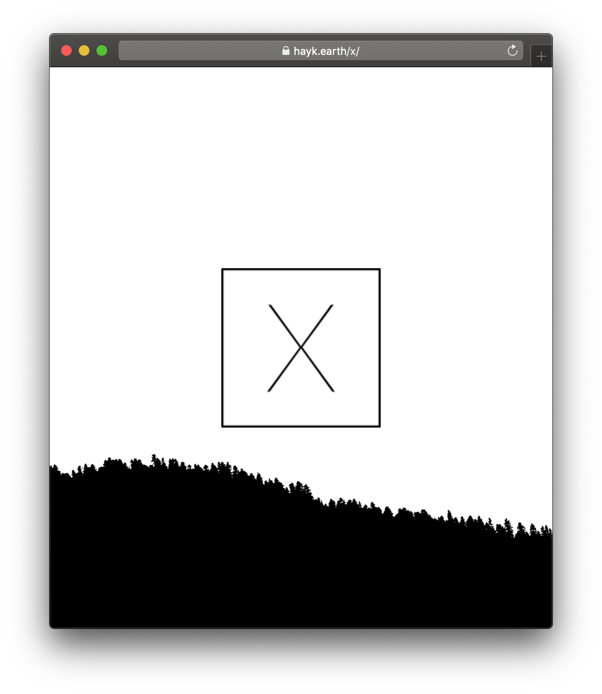

# X

> photography project


The code is old and ugly, but the photos are pretty.



## 📦 Installation

### 📋 Clone repo

```sh
git clone https://github.com/haykkh/x.git

cd x

yarn
```

### ⬇️ Direct download

[x-master.zip](https://github.com/haykkh/x/archive/master.zip)

```sh
cd x-master

yarn
```

## 🚀 Usage

Uses [Parcel](https://parceljs.org/) to bundle files.

```sh
yarn start  # start development server

yarn build  # build website into ./docs/
```

## 📝 Contributing

1. Fork it (<https://github.com/haykkh/x/fork>)
2. Create your feature branch (`git checkout -b feature/fooBar`)
3. Commit your changes (`git commit -am 'Add some fooBar'`)
4. Push to the branch (`git push origin feature/fooBar`)
5. Create a new Pull Request

## 👨🏻 Meta

Hayk Khachatryan – [hi@hayk.io](mailto:hi@hayk.io)

[github.com/haykkh](https://github.com/haykkh/)
